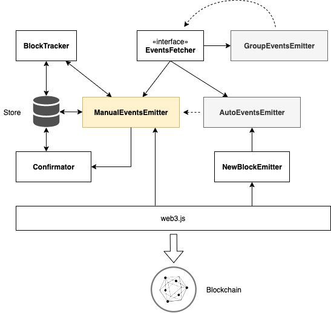
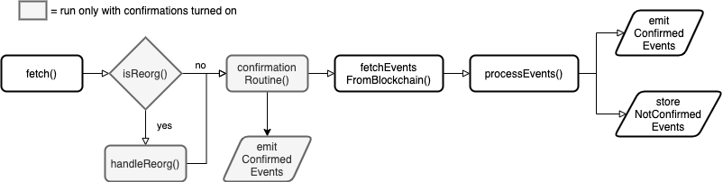

# Web3 Events

[](https://circleci.com/gh/rsksmart/web3-events/)
[](https://david-dm.org/rsksmart/web3-events)
[](http://iovlabs.org)
[](https://github.com/RichardLitt/standard-readme)
[](https://github.com/feross/standard)
[](https://github.com/auhau/tasegir)


> Library for robust handling of web3 events listening and basic blockchain reorganisations.
test
## Table of Contents

- [Usage](#usage)
    - [Components overview](#components-overview)
    - [Confirmations](#confirmations)
    - [Logger support](#logger-support)
- [API](#api)
    - [`Web3Events` class](#web3events-class)
    - [`Contract` class](#contract-class)
    - [`ManualEventsEmitter<Events>` class](#manualeventsemitterevents-class)
    - [`AutoEventsEmitter<Events>` class](#autoeventsemitterevents-class)
    - [`GroupEventsEmitter<Events>` class](#groupeventsemitterevents-class)
- [Contribute](#contribute)
- [License](#license)

## Usage

```ts
import { Web3Events, Contract } from 'web3-events'
import { Eth } from 'web3-eth'
import Sequelize from 'sequelize'

const sequelize = new Sequelize(...) // Defined in your application
const eth = new Eth('provider')

await Web3Events.init(sequelize)
const events = new Web3Events(eth, {store: {}})

const coolContract = new Contract(abi, '0x123', 'coolContract')
type SomeEvent = { returnValues: {data: string} }
const eventsEmitter = events.createEventsEmitter<SomeEvent>(coolContract, { events: ['SomeEvent'] })
eventsEmitter.on('event', (event: SomeEvent) => {
  console.log('We got Some Event with data: ', event.returnValues.data)
})
```

### Components overview

There are several building blocks that cooperate to make the listening on events happen. Bellow is a basic overview:

 - `Web3Events`: higher level class that serves as glue for the rest of the components, making easier for users to create `EventsEmitters`.
 - `BlockTracker`: component that serves for persistent storage of data regarding what blocks were fetched or processed.
 - `NewBlockEmitters`: component that tracks whether there is a new block on the blockchain. It serves as a trigger for most of the actions in the others components.
 - `Confirmator`: component that handles confirmations of blocks based on the configuration.
 - `EventsFetcher`: the main interface that defines simple API for fetching events. There are three implementations.
    - `ManualEventsEmitter`: this implementation works only through `fetch()` method that you have to call yourself manually.
    - `AutoEventsEmitter`: this implementation use `NewBlockEmitter` to automatically trigger `fetch()` upon new blocked detected and emits them as events.
    - `GroupEventsEmitter`: this implementation groups already existing Emitters under one Emitter. Mainly used for logical groupping of Contracts or when you need cross-Contract order dependant Events processing.



### Confirmations

Blockchain reorganization is a well-known problem that makes development of blockchain's client applications rather hard, because the data can change under your hand.
This library tries to tackle this problem with basic approach of supporting confirmations a.k.a waiting configured number of blocks before
pronouncing a block valid. The main downside of this approach is that **once event is confirmed, then there is nothing to do about it**.
Choosing the numbers of confirmations is important and it is the eternal struggle between security and user experience. If you will
use a lot of confirmations you can be pretty sure that the block won't disapear in blockchain, but in the same time you are keeping your users waiting.

Do your own research about statistics of depth of reorgs (eq. how many blocks becomes orphaned in reorganization) on your blockchain and decide based on your usecase!

### Logger support

This library has extensive logging support. By default these log are aggregated by [`debug`](https://www.npmjs.com/package/debug) package which
has basic logging capability mainly for development stage. If you want to view the logs set environmental variable `DEBUG='web3events*'.

You can pass your own logger for better logging support it just have to adhere to the `Logger` interface having functions:
`debug()`, `verbose()`, `info()`, `warn()` and `error()`. The signature of these functions is: `(message: string | object, ...meta: any[]) => void`.

Optionally it can have function `extend(name: string) => Logger` that creates a new Logger with an extended name. E.g. if you have for example
logger `web3events` calling on it `extend('blockTracker')` would returned logger with name `web3events:blockTracker`.

### Fetch flow

To better understand what happens when events are fetched from blockchain see bellow flow chart.



## API

#### `Web3Events` class

Higher level class that serves as glue for the rest of the components. It encapsulate several dependencies that `EventsEmitters` have like `BlockStore`, `Eth` instance and `NewBlockEmitter`, making easier for users to create `EventsEmitters`.

##### `constructor(eth, options)`

**Parameters:**

- `eth` (`Eth`) - instance of web3.js's Eth, that defines the connection to the blockchain.
- `options` (`Web3EventsOptions` | `undefined`) - several non-mandatory options.
- `options.store` (`object` | `undefined`) - an object that serves as store where `BlockTracker` stores all metadata about processed and fetched block. It is good idea to use some solution that will
make this data persistent across restarts of the application, for example [`sequelize-store`](https://github.com/AuHau/sequelize-store). If not passed than you have to pass your own instance of `BlockTracker`
when calling `createEventsEmitter()`.
- `options.logger` (`Logger` | `undefined`) - instance of custom logger as described in [Logger support](#Logger_support).
- `options.defaultNewBlockEmitter` (`NewBlockEmitterOptions` | `NewBlockEmitter` | `undefined`) - either `NewBlockEmitter` instance or
options that should be used to construct default `NewBlockEmitter` that will be used when no instance is passed to the `createEventsEmitter()`.

##### `static init<Events>(sequelize) => Promise<void>`

Initialization function which adds our database models to Sequelize instance. Needs to be run prior creating `Web3Events` instance.

**Parameters:**

 - `sequelize` (`Sequelize`) - instance of Sequelize

##### `createEventsEmitter<Events>(contract: Contract, options: EventsEmitterCreationOptions) => AutoEventsEmitter<Events>`

The main method that creates [`AutoEventsEmitter`](#EventsEmitter_class) class with either provided or default `NewBlockEmitter`.

**Parameters:**

 - `contract` (`Contract`) - instance of `Contract` that the events will be listened upon
 - `options` (`EventsEmitterCreationOptions | undefined`) - options that can customize the creation of the `AutoEventsEmitter`
    - `options.blockTracker` (`BlockTracker`) - Instance of custom BlockTracker used for the Events Emitter
    - `options.newBlockEmitter` (`NewBlockEmitter | NewBlockEmitterOptions`) - NewBlockEmitter instance or its options that will be used to create it
    - `options.logger` (`Logger`) - Custom Logger instance
    - `options.serialListeners` (`boolean`) -  Defines if the listeners should be processed serially.
    - `options.serialProcessing` (`boolean`) - Defines if the events should be kept in order and processed serially.
    - `options.autoStart` (`boolean`; default is `true`) - Defines if the EventsEmitter should automatically start listening on events when an events listener for events is attached.
    -  for other options see `ManualEventsEmitterOptions`

##### `groupEventsEmitters<Events>(eventsEmitters: AutoEventsEmitter<any>[], options: CreateGroupEmitterOptions) => AutoEventsEmitter<Events>`

Method that takes several EventsEmitters and group them under one emitter.

The EventsEmitters must not have any newEvents listeners! Nor they can be attached later on!

Except of some logical grouping of Emitters, this is mainly meant for Contracts that have order depending evaluation.
If that is the case use the flag `options.orderedProcessing` with most probably `options.serialProcessing` flag.

**Parameters:**

 - `eventsEmitters` (`EventsFetcher[]`) - array of Emitters that will be grouped.
 - `options` (`CreateGroupEmitterOptions` | `undefined`) - for all options see `CreateGroupEmitterOptions`. Bellow is basic listing.
    - `options.orderedProcessing` (`boolean`) - defines if the events from emitters ordered using blockNumber, transactionIndex and logIndex to determine order of the events.
    - `options.newBlockEmitter` (`NewBlockEmitter | NewBlockEmitterOptions`) Custom instance of NewBlockEmitter
    - `options.serialListeners` (`boolean`) -  Defines if the listeners should be processed serially.
    - `options.serialProcessing` (`boolean`) - Defines if the events should be kept in order and processed serially.
    - `options.autoStart` (`boolean`; default is `true`) - Defines if the EventsEmitter should automatically start listening on events when an events listener for events is attached.

#### `Contract` class

A class that extends web3.js's `Contract` class with some metadata.

##### `contstructor(abi, address, name)`

**Parameters:**
- `abi` (`AbiItem[]`) - ABI that defines the Contract
- `address` (`string`) - an address of the deployed contract
- `name` (`string`) - a name of the Contract used mainly for internal usage and logging

#### `ManualEventsEmitter<Events>` class

The main component that performs fetching and processing of Contract's events. **It fetches events from the blockchain
using web3.js's `getPastEvents()` call, so the blockchain node that you are connecting to have to support `eth_getLogs()` call! **

This class serves mainly as the basic building blocks for other components, but if you need your own triggering logic then
it is a standalone component you can use as you wish.

##### `constructor(eth: Eth, contract: Contract, blockTracker: BlockTracker, baseLogger: Logger, options?: ManualEventsEmitterOptions)`

**Parameters:**
 - `eth` (`Eth`) - Instance of Web3.js `Eth` class defining connection to blockchain.
 - `contract` (`Contract`) - Instance of `Contract` class defining the contract of whose events will this emitter will listen on.
 - `blockTracker` (`BlockTracker`) - Instance of `BlockTracker` that will store information about last fetched and processed blocks.
 - `baseLogger` (`Logger`) - Instance of `Logger` that will be used to log information about fetching and confirming events.
 - `options?` (`ManualEventsEmitterOptions | undefined` ) - Options specifying behavior of the Emitter:
    - `options.topics?` (`string[] | string[][] | undefined`) - Non-hashed topics of the Event's signatures. Has priority over `options.events` and at least one has to be specified.
    - `options.events?` (`string[] | undefined`) - Name of events that will be listend on. Less performant then `options.topics`. At least this or `topics` has to be set.
    - `options.batchSize?` (`number | undefined`) - The number of blocks that will be used to determine the size of batch. Default is 120 blocks.
    - `options.confirmations?` (`number | undefined`) - The number of confirmations that events will have to await before they will be passed on.
    - `options.startingBlock?` (`number | undefined`) - The starting block number from which the fetching of events will start from. Most probably the block number of the deployed Contract.

##### `* fetch(options?: FetchOptions) => AsyncIterableIterator<Batch<Events>>`

Method that return async generator that emits batches of events.

It honors Confirmations. So if Confirmations are enabled and there are confirmed events awaiting to be returned, then the first
batch will return those. Be aware that the in this batch all confirmed events are returned and the `batchSize` is not really honored here.

Also, it detects and handles blockchain reorganizations if confirmations are enabled.

**Parameters:**
   - `options` (`FetchOptions`) - Options for fetching the events.
   - `options.currentBlock` (`BlockHeader | undefined`) - Is the latest block on a blockchain, serves as optimization if you have already the information available.
   - `options.toBlockNumber` (`number | undefined`; default is latest block number) - Number of block to which the events will be fetched to INCLUDING.

Batch interface:
```typescript
interface Batch<E> {
  /**
   * Starts with 1 and go up to totalSteps (including).
   * If confirmations are enabled, then the first batch is with confirmed events.
   */
  stepsComplete: number

  /**
   * Number of total batches that gonna be emitted
   */
  totalSteps: number
  stepFromBlock: number
  stepToBlock: number

  /**
   * Actually emitted events.
   */
  events: E[]
}
```

##### Events

It emits a bunch of events that you might be interested in:

 - `progress` (with `Progress` object as payload) - as the events are processed in batches, you will get reporting on what batch is being processed and general progress.
 - `reorg` (only when `confirmations` are enabled) - informational event that notifies you that there was a blockchain reorganisation that was tackled by your confirmation range.
 - `reorgOutOfRange` (only when `confirmations` are enabled) - information event that notifies you that there was a blockchain reorganisation **outside of confirmation range** and hence your state can be invalid.
 - `newConfirmation` (only when `confirmations` are enabled; returns `NewConfirmationEvent` object) - information that there is new confirmation for given event.
 - `invalidConfirmation` (only when `confirmations` are enabled; returns `InvalidConfirmationsEvent` object) - information that during reorganisation that happened in the confirmation range a transaction was dropped.
 - `error` - general event that is emitted whenever something goes wrong

#### `AutoEventsEmitter<Events>` class

Utility class that implements the `EventsFetcher` interface and takes `EventsFetcher` instance (`ManualEventsEmitter` or `GroupEventsEmitter` classes) and using the `NewBlockEmitter` automatically triggers
`fetch` and then emit the fetched events using `newEvent`.

##### `constructor (fetcher: EventsFetcher<E>, newBlockEmitter: NewBlockEmitter, baseLogger: Logger, options?: AutoEventsEmitterOptions)`

Additional `options` are:
 - `options.serialListeners?` (`boolean | undefined`; default: `false`) - Defines if the listeners should be processed serially. This effects if you have multiple listeners on the EventsEmitter, where it will be awaited for a listener to finish (eq. if it returns Promise, then to be resolved) before moving to next listeners.
 - `options.serialProcessing?` (`boolean | undefined`; default: `false`) - Defines if the events should be kept in order and processed serially. This will await for the processing of a event to finish before moving to next event.
 - `options.autoStart?` (`boolean | undefined`; default: `true`) - Defines if the EventsEmitter should automatically start listening on events when an events listener for `newEvent` is attached.

##### `* fetch(currentBlock?: BlockHeader) => AsyncIterableIterator<Batch<Events>>`

This is same like for `ManualEventsEmitter`

##### Events

It emits all the events that `ManualEventsEmitter` emits and additionally:

 - `newEvent` (with `EventLog` object as payload) - the main event which pass to you a ready to be processed event from Contract.

#### `GroupEventsEmitter<Events>` class

EventsFetcher implementation that takes other Emitters and group then under one Emitter interface.
The Emitters have to have same `batchSize` and must not have any `newEvent` listeners (in `AutoEventsEmitter` case).

Also, supports ordering of events across the emitters based on the blockchain's blockNumber, transactionIndex and logIndex values.

It re-emits events from the Emitters, but the data of the events are wrapped in object: `{ name: string, data: any}`
Where `name` is the name of the Emitter the event is coming from and that `data` is data passed into the `emit` function.

##### `constructor(eth: Eth, emitters: EventsFetcher<any>[], options?: GroupEmitterOptions)`

**Parameters:**
 - `eth` (`Eth`) - Instance of Web3.js `Eth` class defining connection to blockchain.
 - `emitters` (`EventsFetcher<any>[]`) - Array of Emitters (eq. either `ManualEventsEmitter` or wrapped `AutoEventsEmitter`) that will be grouped.
 - `options?` (`GroupEmitterOptions | undefined` ) - Options specifying behavior of the Emitter:
    - `options.logger` (`Logger`) - Custom Logger instance
    - `options.name` (`string`) - Name of the group used in logs and error messages
    - `options.orderedProcessing` (`boolean`) - Defines if the events from emitters ordered using blockNumber, transactionIndex and logIndex to determine order of the events.

##### `* fetch(options?: FetchOptions) => AsyncIterableIterator<Batch<Events>>`

Method that return async generator that emits batches of events. Same as for `ManualEventsEmitter.fetch()`.

##### Events

Share the same events like `ManualEventsEmitter`, except that all the events are wrapped in object:

```json5
{
  name: 'name of the emitter that emitted the event',
  data: 'the emitted data'
}
```

## Contribute

There are some ways you can make this module better:

- Consult our [open issues](https://github.com/rsksmart/web3-events/issues) and take on one of them
- Help our tests reach 100% coverage!

## License

[MIT](./LICENSE)
